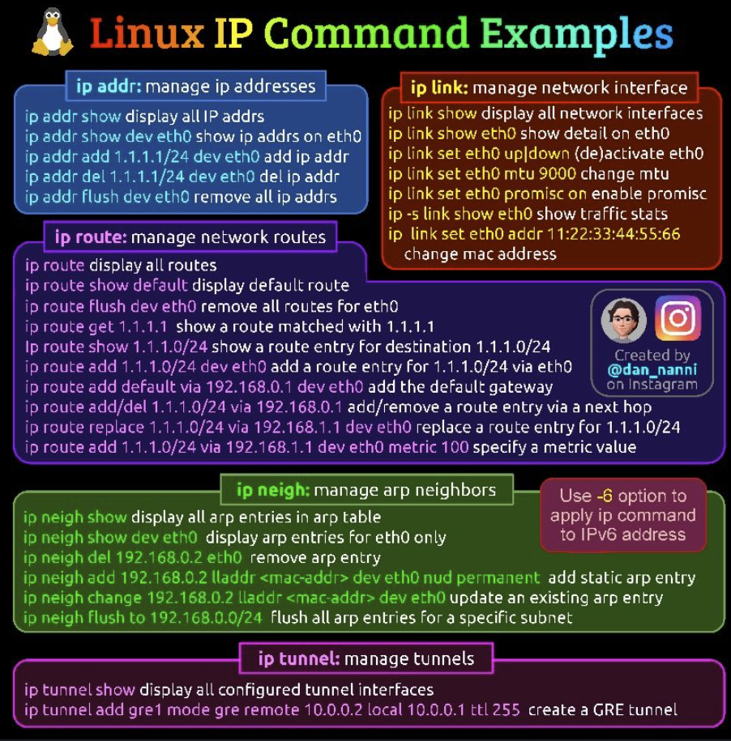

# Presentación del Curso de Informática Orientado a DevOps

## Bienvenida

[Nombre del Documento](./docs/readme2.md)

¡Hola a todos!

Me complace darles la bienvenida a este curso de **Informática Orientado a DevOps**. Mi nombre es Antonio Lefimil, y seré su profesor a lo largo de este apasionante viaje en el mundo de DevOps.

## Objetivos del Curso

En este curso, aprenderemos los principios fundamentales de DevOps, un enfoque que busca integrar el desarrollo de software (Dev) con las operaciones de TI (Ops). Nuestro objetivo es que adquieran las habilidades necesarias para:

- **Automatizar procesos**: Conocerán herramientas de automatización como Jenkins, GitLab CI/CD, y Terraform.
- **Gestionar infraestructura como código**: Aprenderán a utilizar herramientas como Ansible y Docker para gestionar la infraestructura de manera eficiente.
- **Implementar monitorización y logging**: Utilizaremos Prometheus, Grafana, y ELK Stack para asegurar la disponibilidad y el rendimiento de las aplicaciones.
- **Fomentar la colaboración**: Trabajaremos en equipo para resolver problemas reales, implementando buenas prácticas de DevOps.

## Metodología

El curso está diseñado para ser práctico y orientado a proyectos. A lo largo de las sesiones, realizaremos:

- **Talleres prácticos**: Donde aplicaremos lo aprendido en situaciones reales.
- **Proyectos colaborativos**: Desarrollaremos proyectos en equipo para aplicar y consolidar los conocimientos adquiridos.
- **Evaluaciones continuas**: Mediremos su progreso con pequeños tests y desafíos prácticos.

## Recursos

Para este curso, utilizaremos varias herramientas y plataformas que faciliten nuestro aprendizaje:

- **Repositorio GitHub/GitLab**: Todo el material del curso estará disponible en un repositorio donde podrán acceder y contribuir.
- **Documentación oficial y guías**: Se les proporcionarán enlaces a la documentación oficial de las herramientas que utilizaremos.
- **Foro de discusión**: Un espacio donde podrán hacer preguntas, compartir conocimientos, y resolver dudas entre compañeros.

## Contacto

Estoy aquí para ayudarles en todo lo que necesiten. Pueden contactarme en cualquier momento a través del correo electrónico Antonio.lefimil@gmail.com o durante las horas de tutoría que serán anunciadas próximamente.

## ¡Comencemos!

Estoy entusiasmado por iniciar este curso con ustedes y espero que juntos podamos explorar y dominar el mundo de DevOps. ¡Manos a la obra!

---

